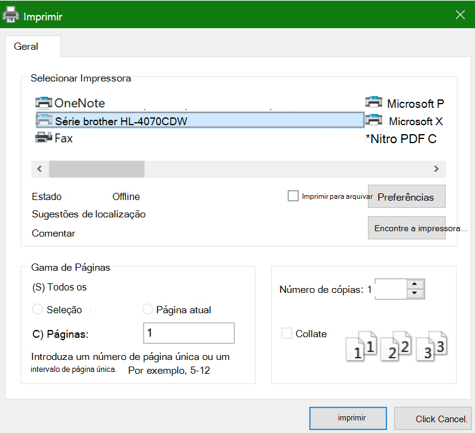

# Impressão em ambos os lados do papel (impressão duplex)

**A minha impressora é capaz de imprimir duplex?**

O resumo ou manual da sua impressora deve dizer-lhe se é capaz de imprimir em ambos os lados do papel, também conhecido como "impressão duplex". Se tiver o Microsoft Office, outra forma de descobrir é abrindo uma aplicação do Office como o Word ou o Excel, indo para **o Arquivo > Imprimir**, certificando-se de que a impressora certa está selecionada e procurando a capacidade na secção Definições. Por exemplo: 

**Impressão duplex no Microsoft Office**

Se a sua impressora for capaz de imprimir em ambos os lados, quando for ao **Arquivo > Imprimir** na aplicação Office, verá uma opção para "Imprimir em ambos os lados", como mostra o exemplo acima.  Selecione o tipo de impressão duplex que deseja (vire-se sobre a borda longa, ou vire-se na borda curta) e clique em **Imprimir** para iniciar a impressão.

**Impressão duplex de qualquer aplicação**

Em muitas aplicações quando imprimir verá um diálogo de impressão geral que se parece com este: 

Certifique-se de que a impressora certa está selecionada e, em seguida, clique em **Preferências** para abrir a janela de preferências da impressora. Se a impressora for capaz de imprimir duplex, a capacidade de permitir isto para a tarefa de impressão atual aparecerá nessa janela.
