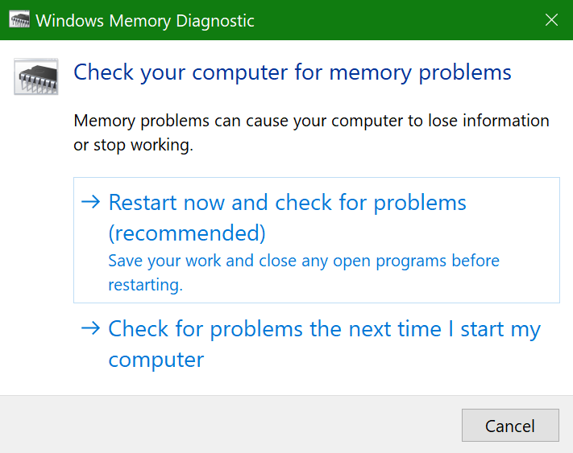

# Executar diagnósticos de memória do Windows no Windows 10

Se o Windows e as aplicações no seu PC estiverem a falhar, a congelar ou a agir de forma instável, poderá ter um problema com a memória do PC (RAM). Pode executar o Diagnóstico de Memória do Windows para verificar se há problemas com a RAM do PC.

Na caixa de pesquisa na sua barra de tarefas, digite o diagnóstico de **memória**e, em seguida, selecione O Diagnóstico da **Memória do Windows**. 

Para executar o diagnóstico, o PC precisa de reiniciar. Tem a opção de reiniciar imediatamente (por favor, guarde o seu trabalho e feche primeiro documentos e e-mails abertos), ou agende o diagnóstico para ser executado automaticamente da próxima vez que o PC reiniciar:

Quando o PC reiniciar, a Ferramenta de **Diagnóstico da Memória do Windows** será executada automaticamente. O estado e o progresso serão apresentados à medida que os diagnósticos são executados, e você tem a opção de cancelar os diagnósticos atingindo a chave **ESC** no seu teclado.

Quando os diagnósticos estiverem completos, o Windows começará normalmente.
Imediatamente após o reinício, quando o Ambiente de Trabalho aparecer, aparecerá uma notificação (junto ao ícone do **Action Center** na barra de tarefas), para indicar se foram encontrados erros de memória. Por exemplo:

Aqui está o ícone do Centro de Ação:  

E uma notificação de amostra: 

Se perdeu a notificação, pode selecionar o ícone do **Action Center** na barra de tarefas para exibir o **Action Center** e ver uma lista de notificações perlocada.

Para rever informações detalhadas, digite **o evento** na caixa de pesquisa na sua barra de tarefas e, em seguida, selecione O Espectador **do Evento**. No painel de mão esquerda do Espectador de **Eventos,** navegue para o Sistema > de **Registos do Windows**. No painel da direita, analise a lista enquanto olha para a coluna **Fonte,** até ver eventos com valor fonte **MemóriaDiagnósticos-Resultados**. Realce cada evento deste tipo e veja as informações de resultados na caixa sob o separador **Geral** abaixo da lista.
