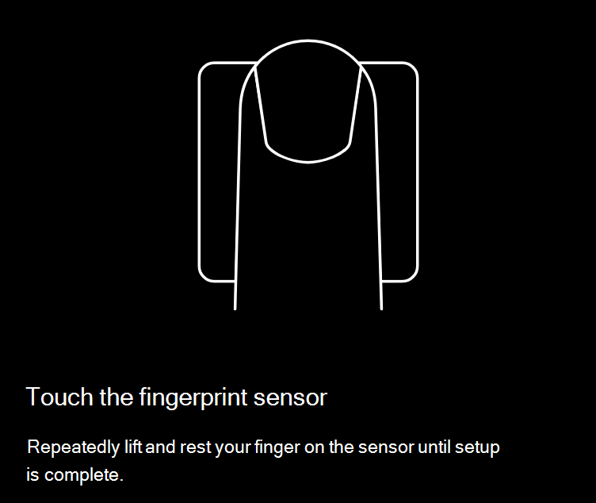

# Utilize a opção de desbloqueio de impressões digitais no Windows 10

**Ativar a impressão digital do Windows Hello**

Para desbloquear o Windows 10 utilizando a sua impressão digital, é necessário configurar a Impressão Digital Windows Hello adicionando (permitindo que o Windows aprenda a reconhecer) pelo menos um dedo. 

1. Aceda a **Definições > Contas > opções de inscrição** (ou clique [aqui).](ms-settings:signinoptions?activationSource=GetHelp) As opções de inscrição disponíveis serão listadas. Por exemplo:

    

2. Clique ou toque no **Windows Hello Fingerprint**e, em seguida, clique em **Configurar**. Na janela de configuração Do Windows Hello, clique **em Iniciar**. O sensor de impressões digitais será ativado, e ser-lhe-á pedido que coloque o dedo no sensor:

   

3. Siga as instruções, que lhe pedirão para digitalizar repetidamente o dedo. Quando isto estiver terminado, terá a opção de adicionar outros dedos que pode querer usar para iniciar sinsus. Da próxima vez que iniciar sôs no Windows 10, terá a opção de usar a sua impressão digital para o fazer.

**Windows Hello Fingerprint não disponível como opção de inscrição**

Se o Windows Hello Fingerprint não for apresentado como uma opção nas **opções de inscrição,** significa que o Windows não tem conhecimento de nenhum leitor/scanner de impressões digitais anexado ao seu PC, ou que uma política do sistema impede a sua utilização (se, por exemplo, o seu PC for gerido pelo seu local de trabalho). Para resolver problemas: 

1. Selecione o botão **Iniciar** na barra de tarefas e procure **por Gestor de Dispositivos**.

2. Clique ou toque para abrir o **Gestor de Dispositivos**.

3. No Device Manager, expanda os dispositivos Biométricos clicando no seu chevron.

   

4. O seu scanner de impressões digitais deve ser listado como um dispositivo biométrico, como o scanner Synaptics WBDI:

   

5. Se o seu scanner de impressões digitais não for mostrado e o scanner estiver integrado no seu PC, aceda ao site do fabricante do PC. Na secção de suporte técnico do seu modelo para PC, procure um controlador Windows 10 para obter um scanner que possa instalar.

6. Se o scanner estiver separado do PC (ligado via USB), vá ao site do fabricante do scanner para encontrar e instalar o software do controlador do dispositivo Windows 10 para o modelo de scanner que tem.
